<p align="center">
  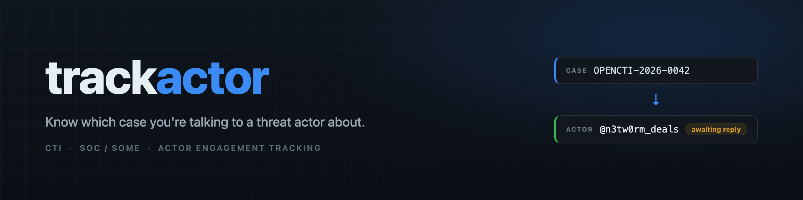
</p>

<p align="center">
  
  
  
  
  
  
</p>

<p align="center"><a href="README.md">English</a> · <b>Türkçe</b></p>

# trackactor

Bir tehdit aktörüyle hangi vaka üzerinden konuştuğunu takip et.

## Problem

İstihbarat platformundan ya da SOC araçlarından bir vaka düşer. Aktöre ulaşırsın:
forum mesajı, bir Telegram hesabı, bir XMPP adresi, bir pazar yeri sohbeti.
Birkaç gün sonra `@bir_kullanici` üzerinden bir yanıt gelir ve bunun hangi vakaya
ait olduğunu hatırlamazsın; çünkü o sırada üç ayrı aktörle dört ayrı yazışma
yürütüyorsundur.

trackactor bunu çözer. Yaptığın teması, sahip olduğun vaka ID'sine baştan
bağlarsın. Yanıt geldiğinde kullanıcı adını veya bağlantıyı arama kutusuna
yapıştırırsın; vakayı, aktörü, bağlı kanalları ve o ana kadarki yazışmayı geri
alırsın.

CTI ekipleri, SOC / SOME analistleri ve aktör temasını kayıt altında tutması
gereken herkes için. İşine kendi araçlarınla entegre edebilmen için bir REST API
de var.

## Ekran görüntüleri

**Panel** — duruma göre açık vakalar ve yeni gelen yanıtlar.

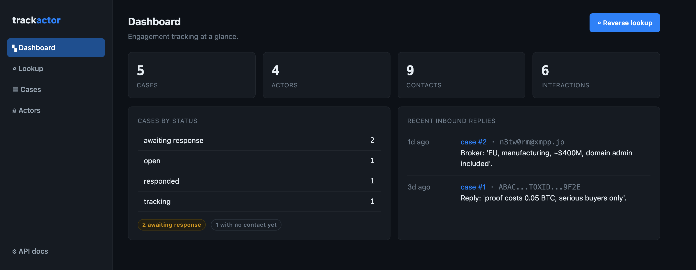

**Ters arama (reverse lookup)** — işin özü. `https://t.me/n3tw0rm_deals`,
`@n3tw0rm_deals` ve `tg://resolve?domain=n3tw0rm_deals` aynı anahtara normalize
olur ve aynı vakaya çıkar.

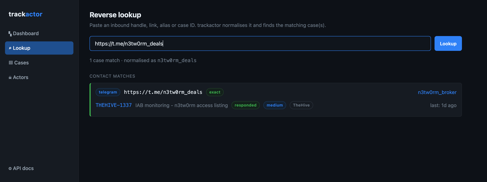

**Vakalar** — platformunun zaten verdiği ID ile anahtarlanmış her tema.

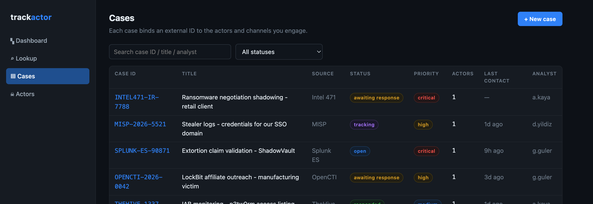

**Vaka detayı** — bağlı aktörler ve kanallar, ayrıca gelen/giden mesaj kaydı.

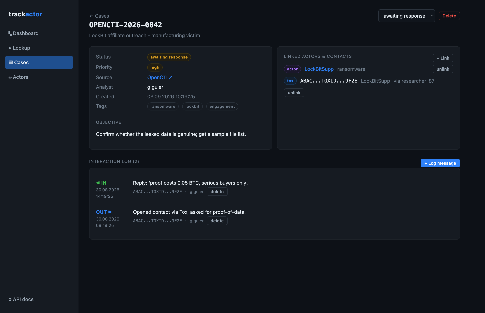

**Mesajlar** — tüm vakalardaki kaydı aynı yerden ara, yöne göre süz.

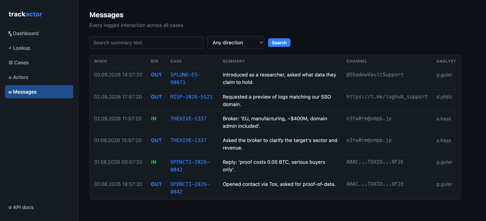

**Ayarlar** — otomasyonun için API key'leri ve imzalı giden webhook'lar.

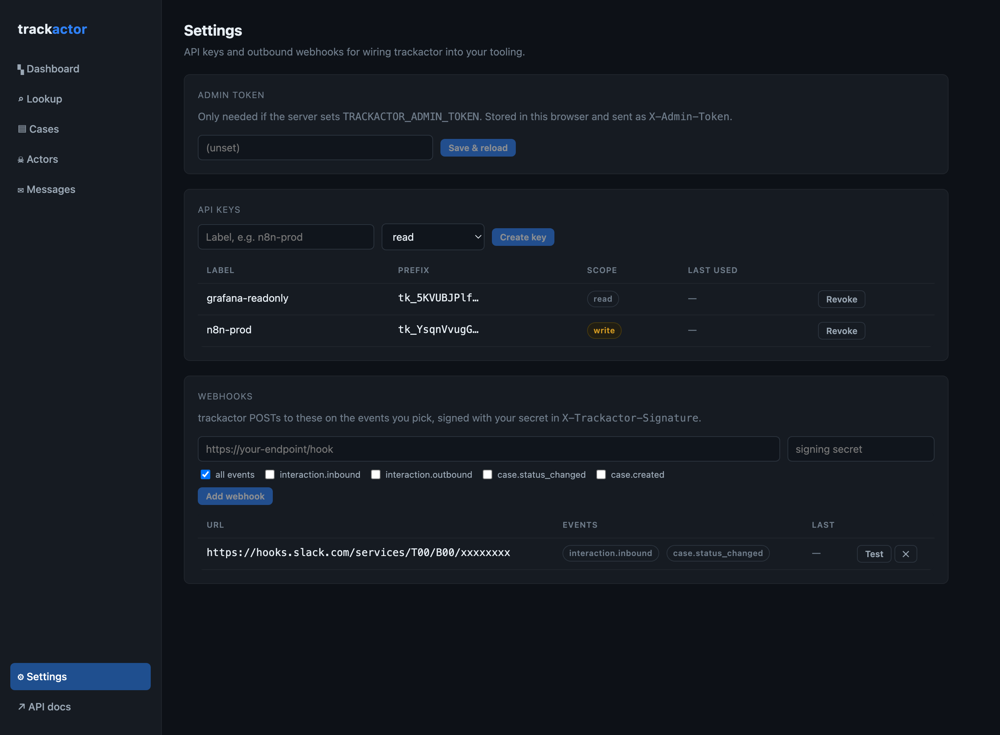

**Denetim (Audit)** — her değişiklik, kimin yaptığı ve öncesi/sonrası.

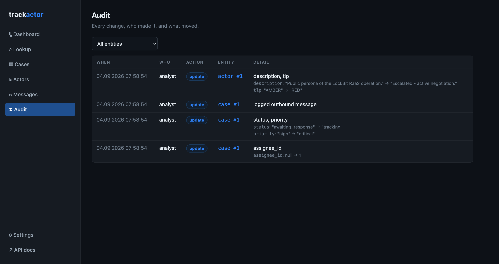

**Aktör detayı** — kanallar, tüm vakalardaki konuşma zaman çizelgesi ve geçmiş.

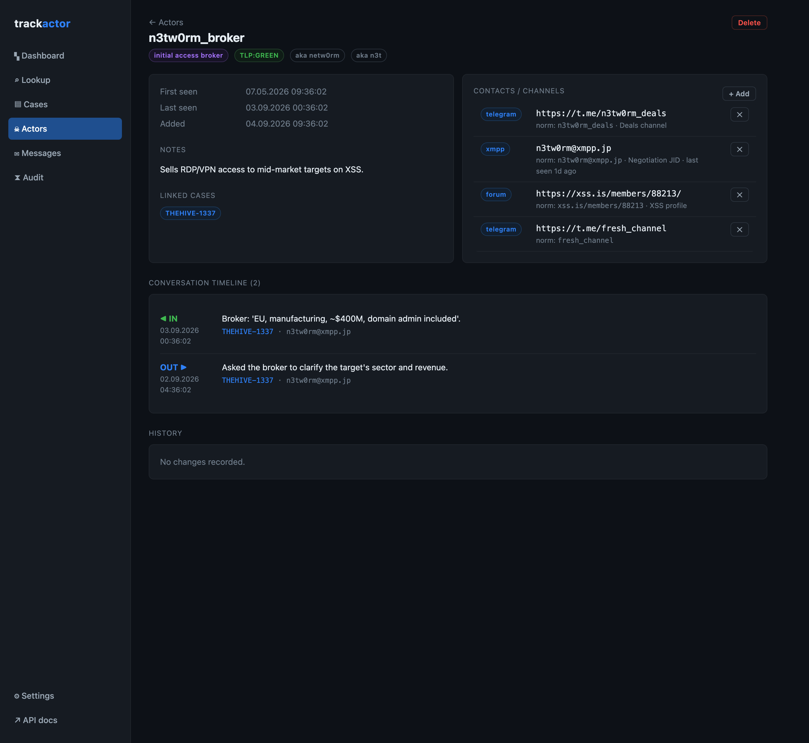

**İçe aktarma** — MISP, TheHive ya da bir STIX 2.1 paketinden vaka çek.

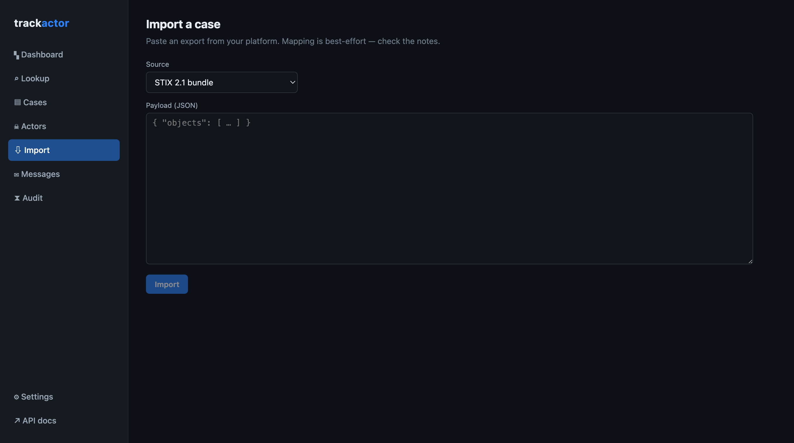

## Parçalar nasıl birleşiyor

- **Case (Vaka)** — takip edilen bir tema; dış `case_id`'niz ve kaynak
  platformuyla (OpenCTI, MISP, TheHive, Splunk ES, Intel 471, ...) anahtarlanır.
- **Actor (Aktör)** — bir tehdit aktörü, grubu veya personası; takma adlar ve TLP
  etiketiyle.
- **Contact (İletişim kimliği)** — bir aktöre ait tek bir iletişim tanımlayıcısı;
  `t.me/x`, `@x` ve `tg://resolve?domain=x` eşleşsin diye normalize edilmiş
  biçimiyle saklanır.
- **Interaction (Etkileşim)** — bir vakaya işlenmiş gelen ya da giden bir mesaj.
- **Attachment (Ek)** — bir vakaya (ya da tek bir mesaja) iliştirilmiş kanıt dosyası; TLP etiketli ve hash'li.

Bir vaka bir veya daha fazla aktöre ve/veya doğrudan belirli iletişim
kimliklerine bağlanır; böylece kimlik henüz bir aktöre atfedilmemiş olsa bile
yanıt yine de vakaya çözülür. `awaiting_response` durumundaki bir vakaya gelen
bir mesaj işlediğinde durum kendiliğinden `responded` olur. Vakanın bir atanan
kişisi ve oluşturanı vardır; vaka ve aktördeki her değişiklik öncesi/sonrası
farkıyla denetim kaydına düşer.

## Çalıştırma

### Docker

```bash
docker compose up -d --build
```

http://localhost:8080 adresini aç. API `/api` altından proxy'lenir, dokümanlar
http://localhost:8080/api/docs adresinde. SQLite veritabanı `trackactor-data`
volume'unda tutulur.

Örnek veriyi yükle (opsiyonel):

```bash
docker compose exec backend python -m app.seed
```

### Yerel

Backend:

```bash
cd backend
python -m venv .venv && source .venv/bin/activate
pip install -r requirements.txt
python -m app.seed          # opsiyonel örnek veri
uvicorn app.main:app --reload --port 8000
```

Frontend:

```bash
cd frontend
npm install
npm run dev
```

Geliştirme sunucusu http://localhost:5173 adresinde çalışır ve `/api`'yi 8000
portuna proxy'ler.

## API

Her şey `/api` altında; tam şema `/api/docs` adresinde. Kimlik doğrulama
varsayılan olarak kapalı (bkz. [Yapılandırma](#yap%C4%B1land%C4%B1rma)); entegrasyon
örnekleri [docs/integrations](docs/integrations/README.md) içinde.

```bash
# vaka oluştur
curl -X POST localhost:8000/api/cases -H 'content-type: application/json' -d '{
  "case_id": "OPENCTI-2026-0042",
  "title": "LockBit affiliate outreach",
  "source_platform": "OpenCTI",
  "status": "awaiting_response"
}'

# yanıt geldi - bu hangi vaka?
curl 'localhost:8000/api/lookup?q=https://t.me/n3tw0rm_deals'
```

| Metod | Yol | Amaç |
| --- | --- | --- |
| `GET` | `/api/lookup?q=` | kullanıcı adı / bağlantı / takma ad / vaka id'sini vaka(lar)a çöz |
| `POST` | `/api/capture` | tek çağrıda vaka + aktör + iletişim kimliği + mesaj oluştur/güncelle ve bağla |
| `GET` `POST` | `/api/cases` | vakaları listele / oluştur |
| `GET` `PATCH` `DELETE` | `/api/cases/{id}` | aktörleri, kimlikleri ve kaydıyla tek vaka |
| `POST` | `/api/cases/{id}/links` | var olan bir aktörü veya kimliği vakaya bağla |
| `POST` | `/api/cases/{id}/contacts` | tek adımda kanal oluştur ve bağla |
| `POST` | `/api/cases/{id}/interactions` | bir mesaj işle |
| `GET` | `/api/cases/{id}/export` | devir için tek parça JSON paketi |
| `GET` | `/api/export/cases.csv`, `/api/export/interactions.csv` | düz CSV dökümleri |
| `GET` `POST` | `/api/cases/{id}/attachments` | kanıt dosyaları (multipart yükleme) |
| `GET` `DELETE` | `/api/attachments/{id}` | ek indir / sil |
| `POST` | `/api/import` | `misp` / `thehive` / `stix`'ten vaka içe aktar |
| `GET` | `/api/actors/similar?name=`, `/api/contacts/similar?value=` | yakın-kopya kontrolü |
| `GET` | `/api/interactions?q=` | mesaj kaydında ara (`case_id`, `actor_id`, `direction` süzgeçleri) |
| `GET` `POST` | `/api/actors` | aktörler ve takma adları |
| `POST` | `/api/actors/{id}/contacts` | bir aktöre kanal ekle |
| `GET` `POST` | `/api/contacts` | iletişim kimliklerinde ara |
| `GET` | `/api/stats` | panel sayaçları |
| `POST` | `/api/auth/login` `logout`, `GET /api/auth/me` | web arayüzü için oturum girişi |
| `GET` | `/api/audit` | denetim kaydı (`entity_type`, `entity_id` süzgeçleri) |
| `GET` `POST` `PATCH` | `/api/users` | hesaplar (listeleme herkese açık; oluşturma/düzenleme admin korumalı) |
| `GET` `POST` `DELETE` | `/api/keys` | API key yönetimi (admin korumalı) |
| `GET` `POST` `PATCH` `DELETE` | `/api/webhooks` | giden webhook yönetimi (admin korumalı) |

Liste uçları (`/api/cases`, `/api/actors`, `/api/contacts`, `/api/interactions`)
`{ items, total, limit, offset }` döndürür; `limit` (en fazla 200) ve `offset` alır.

## Tarayıcı eklentisi

`extension/` klasörü Chrome / Edge / Firefox için paketlenmemiş bir MV3
eklentisi. Bir CTI platformu sayfasındaki vaka ID'sini ya da açık olan Telegram
Web sohbetinin `@handle`'ını alıp, sayfadan çıkmadan `/api/capture` üzerinden bir
vakaya işler. Bkz. [extension/README.md](extension/README.md). Hiçbir şey
kurmadan ters arama için [extension/tools/](extension/tools/bookmarklet.js)
içinde bir bookmarklet var.

| Yakala | Bağlandı | Ters arama |
| --- | --- | --- |
| 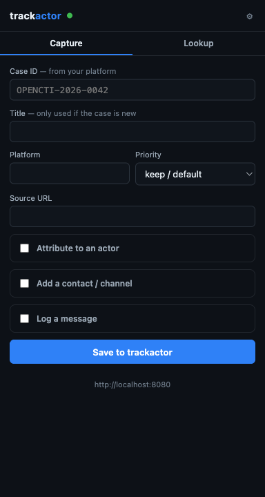 | 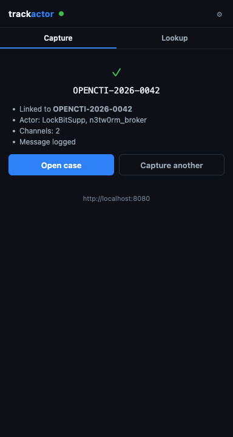 | 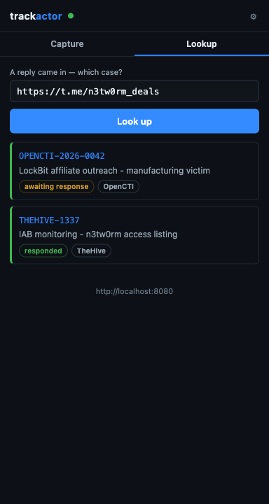 |

## Yapılandırma

`backend/.env` ya da doğrudan ortam değişkenleri:

- `TRACKACTOR_DB_URL` — SQLAlchemy URL'i, varsayılan `sqlite:///./trackactor.db`
- `TRACKACTOR_CORS_ORIGINS` — yerel geliştirmede API'yi çağırmasına izin verilen origin'ler (virgülle ayrılmış)
- `TRACKACTOR_REQUIRE_KEY` — `true` iken her `/api` çağrısı `X-API-Key` ister; yazma işlemleri `write` kapsamlı key ister (varsayılan `false`)
- `TRACKACTOR_REQUIRE_LOGIN` — `true` iken web arayüzü giriş ekranı gösterir ve `/api` oturum çerezi ister (otomasyon için API key yine geçerli)
- `TRACKACTOR_ADMIN_TOKEN` — `/api/keys`, `/api/webhooks` ve kullanıcı oluşturmayı korur. Sadece hiçbir kilit yokken açık; `REQUIRE_KEY` ya da `REQUIRE_LOGIN` açıldığında bu token'la ya da admin oturumuyla erişilir.
- `TRACKACTOR_DATA_DIR` — kanıt dosyalarının yazıldığı yer (varsayılan `./data`)
- `TRACKACTOR_MAX_UPLOAD_MB` — ek dosya boyut sınırı (varsayılan `25`)

İlk hesabı `cd backend && python -m app.users add <ad> --admin` ile oluştur
(örnek seed ayrıca `analyst` / `analyst` ekler). Key'ler ve webhook'lar arayüzde
**Ayarlar**'dan yönetilir. Webhook'lar `interaction.inbound`,
`interaction.outbound`, `case.status_changed`, `case.created` olaylarını gizli
anahtarınla imzalayıp (`X-Trackactor-Signature`) POST eder, üç kez dener.

Şema Alembic ile yönetilir; `init_db()` açılışta `alembic upgrade head` çalıştırır
ve migration öncesi bir veritabanını otomatik olarak devralır.

Varsayılan SQLite. Postgres için `TRACKACTOR_DB_URL`'i bir
`postgresql+psycopg://…` URL'ine ayarla ya da paketteki servisi
`docker compose --profile postgres up` ile çalıştır. Test paketi CI'da her
ikisine karşı koşar.

## Teknoloji

Backend'de FastAPI, SQLAlchemy, Alembic ve SQLite; frontend'de React, TypeScript
ve Vite. Backend testleri: `cd backend && pytest`.

## Notlar

- Kimlik doğrulama opsiyonel ve kaba (bir key = bir kapsam; bir rol = admin ya da
  değil). Ciddi bir kurulumda yine iç ağda ya da kendi proxy'nin arkasında çalıştır.
- SQLite bir ekip için yeterli. Büyürsen `TRACKACTOR_DB_URL`'i Postgres'e yönlendir.

## Lisans

MIT
